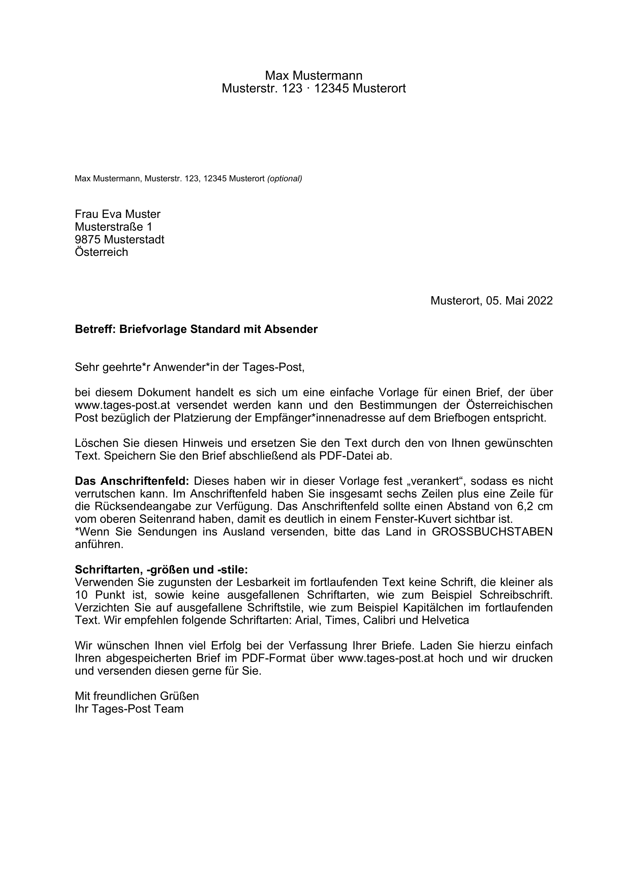

<meta name='keywords' content='Austria, Österreich, Post AG, Brief, letter, template, reportlab, python'>

# Austrian Post Letter Template

## Description

This tool aims to fill variables (of a given dataset input) into the Austrian [Post AG - Vorlage mit Absender](https://www.einfach-brief.at/fe/assets/files/EinfachBrief-Vorlage-Musterbrief_Standard_mit_Absender.docx) letter template using ReportLab library in Python and save it as a .pdf file. The main features are:

- Create a .pdf letter in A4 respecting the [letter design settings](https://www.einfach-brief.at/fe/vorlagen) defined by the Post AG.
- Iteration to create a .pdf with multiple pages (one letter per page), taking recipients from a given dataset (an example is provided in the [at-post-letter-template.py](at-post-letter-template.py) code).
- Fully personalizable: each text block is divided into frames; for each frame, it is possible to change the font and font size, add boundary to the text frames, change text colors, etc. Also specific words/sentences can be formatted (bold, italic, etc.) using simple HTML.

## Output

<p align="center">

</p>

# Usage

## Python dependencies

```.ps1
python -m pip install babel pandas reportlab
```

## Functions

### create_document

```.py
create_document(df, title, author, file_name)
```

#### Description

- Fill variables (of a given dataset input) into the Austrian Post AG - Vorlage mit Absender letter template and outputs it as a .pdf file.

#### Parameters

- `df`: _DataFrame_. List of Strava Club ids in which the tool should scrap data from (e.g. `club_ids = ['445017', '1045852']`).
- `title`: _str_. PDF title metadata attribute (e.g. `title='Post AG - Vorlage mit Absender'`).
- `author`: _str_. PDF author metadata attribute (e.g. `author='Post AG'`).
- `file_name`: _str_. File name of the generated Austrian Post AG - Vorlage mit Absender letter template (e.g. `file_name='Post AG - Vorlage mit Absender.pdf'`).

# Documentation

[Post AG Österreich - Briefgestaltung](https://www.einfach-brief.at/fe/vorlagen)
